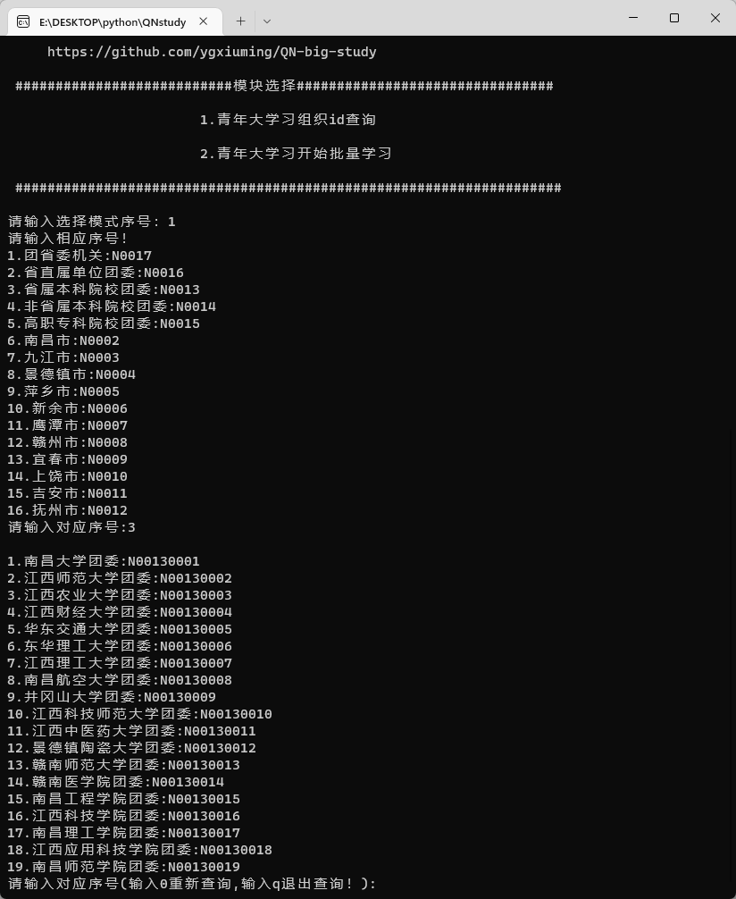
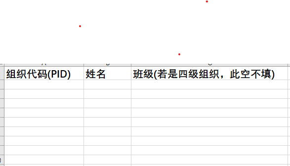
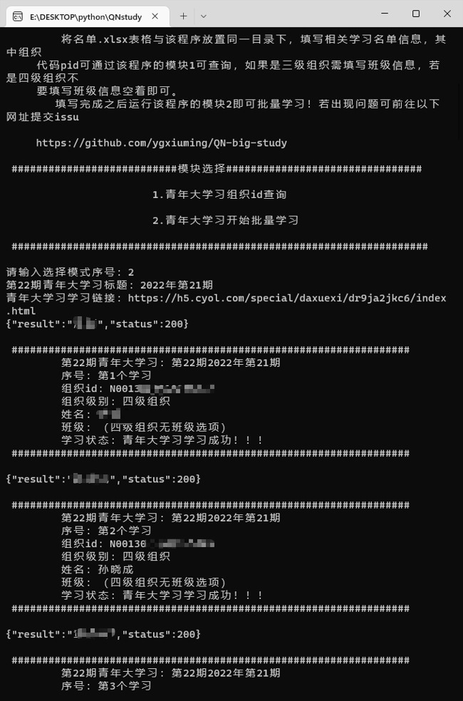

<h1 align="center">江西青年大学习批量过后台</h1>
<h1 align="center">适用于2023新版青年大学习善德教育系统</h1>

    
    
    
    

<h3 align="center">不断更新中....</h3>

 ### 环境：
    requests 
    xlrd == 1.2.0 //最新版xlrd==2.0.1不支持xlsx文件的读取 
    python3.6以上 

 
<h2>功能：</h2>

 新设团委id查询

 批量学习(不限制学校，班级，全自动化)

理论上江西省所有学校所有专业都适用，请自行测试

 增加青年大学习学习截图功能，可供选择批量产生截图

 添加docker在GitHub action 定时运行

 accesstoken可以在记录后台获取，目前正在写批量获取脚本，目前先自行获取。

后台地址：http://106.225.141.143:8103  然后按F12可以找得到，也可以自行抓包获取，填入对应excel中即可

 仅仅测试少量数据，若有问题，请发issue

 
 

<h2>更新记录</h2>
2022/05/20 发布青年大学习单人学习 
2022/05/22 发布青年大学习多人学习版本 
2022/05/23 更新青年大学习脚本（江西共青团服务器更新） 
2022/09/26 关于xlrd模块版本说明 
2022/09/27 打包版本发布(仅仅适用于windows系统) 
2022/11/13 Cnlomou添加docker启动以及定时任务 
2022/11/14 推出单个学习截图以及批量导出学习截图功能 
2022/11/14 解决python版本对于xlrd不兼容问题         
2022/12/20 解决无法获取最新一期青年大学习的问题    
2023/07/02 解决增加accesstoken验证  请使用study_20230702.py
2023/07/10 增加多线程，加快处理速度！

 
 
 

## GitHub action 定时运行使用说明
- 1.fork仓库到自己的仓库
- 2.下载仓库的`名单.xls`文件
- 3.按照下面的使用说明填写相关内容在`名单.xls`文件中，保存并上传至你fork的仓库。 [不会填写参数](#peizhi)
- 4.设置定时时间。   [怎么设置时间参数?](https://docs.github.com/cn/actions/using-workflows/events-that-trigger-workflows#schedule)
- 5.修改你fork 仓库内的`QN-big-study/blob/main/.github/workflows/docker-image.yml`内的文件(默认是每周3晚上9点多定时执行)
~~~
on:
   schedule:
    - cron: "20 13 * * 3"  #这里是每周3晚上9点多 
~~~
- 6.接下来可以关闭你的电脑，每周都会根据你的时间设定自动学习默认是每周3晚上9点多定时执行()。

 
<h2>使用说明：</h2>

### 将整个项目 Fork到自己仓库/拉取到本地/下载到本地
### pip3 install -r requirements.txt 安装依赖
 

<h3>step1:下载本仓库所有代码，运行QN_study.py程序，如下图所示</h3>
    

一共有两个模块，其中需要查询班级的组织id进行配置，请输入`1`进入`青年大学习组织id查询`如下图

后方一串数字即为组织id，继续选择下去，直到班级。例如：N00130001******，记住他

<h3>step2：配置相关学习数据，打开名单.xlsx，填入相关信息</h3>

把刚刚记住的填入组织代码处，若是三级组织需要填写班级，若是四级组织，班级空着即可，不需要填写。保存即可

 

tips：excel文件一定要与程序位于同一个目录下，否则会出错！！！

<h3>step3：再次打开程序，选择批量学习，即可完成学习！</h3>

## 特别鸣谢
* [@Cnlomou](https://github.com/Cnlomou/QN-big-study)「Cnlomou」
 
1、接决依赖缺少问题
 
2、添加定时任务
 
3、添加docker启动

 

## &#8627; Stargazers

 

## &#8627; Forkers

 

<h1>程序打包资源</h1>

<a href ='https://wwd.lanzoum.com/b01pvee8j'>蓝奏云</a>
https://wwd.lanzoum.com/b01pvee8j 密码：8888

有问题请发issue，看到会回复！

<h1>最后的最后，可以给我一个star吗？万分感谢！</h1>
